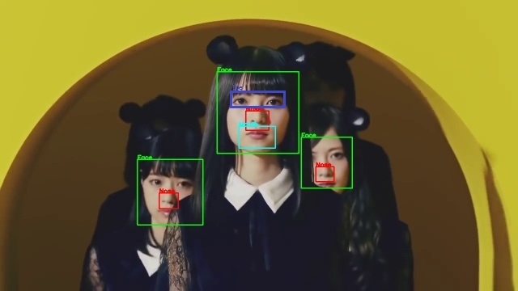

# Face-Nose-Eye-Pair-Mouth-Detection-in-Image-and-Video-Using-Opencv-Python
Simple programs for detecting Face, Nose, Eye Pair and Mouth Detection in Opencv-Python with Cascade Classifiers
---
##### Note: Provide Names of Test files of image in test_image.py and video in test_video.py
---
## Description
#### Result

In above image we can see
1. Green rectangle representing detected Face
2. Blue rectangle representing detected Eye Pair
3. Red rectangle representing Nose
4. Cyan rectangle representing Mouth

---
## Steps
#### Detect in Image
1. Open detect_from_photo.py file and Replace "test_image.jpg" with Your filename, save.
2. Run detect_from_photo.py
3. Press any key to exit

#### Detect in Video
1.  Open detect_from_video.py file and Replace "test_video.mp4" with Your filename, save.
2. Run detect_from_video.py
3. Press "q" to exit
---
